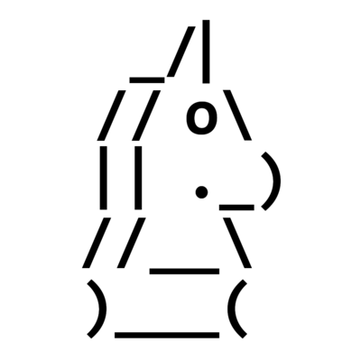

# ChessBot

## Description
Chess Bot implementaion using the Lichess API

## Contributors
Logan Watson\
Patrick "Jack" Harmer

## References
Conventions\
[Conventional Commits](https://www.conventionalcommits.org/en/v1.0.0/)\
[Python PEP8 Style Guide](https://peps.python.org/pep-0008/)\
[GitHub Get Started Guide](https://docs.github.com/en/get-started)

Resources\
[Lichess Bot API](https://lichess.org/api#tag/Bot)